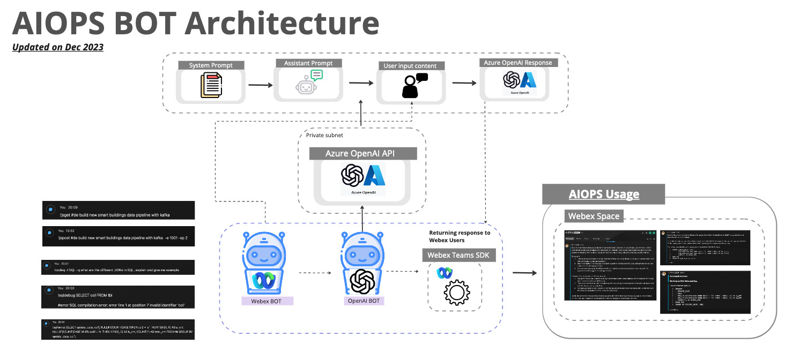
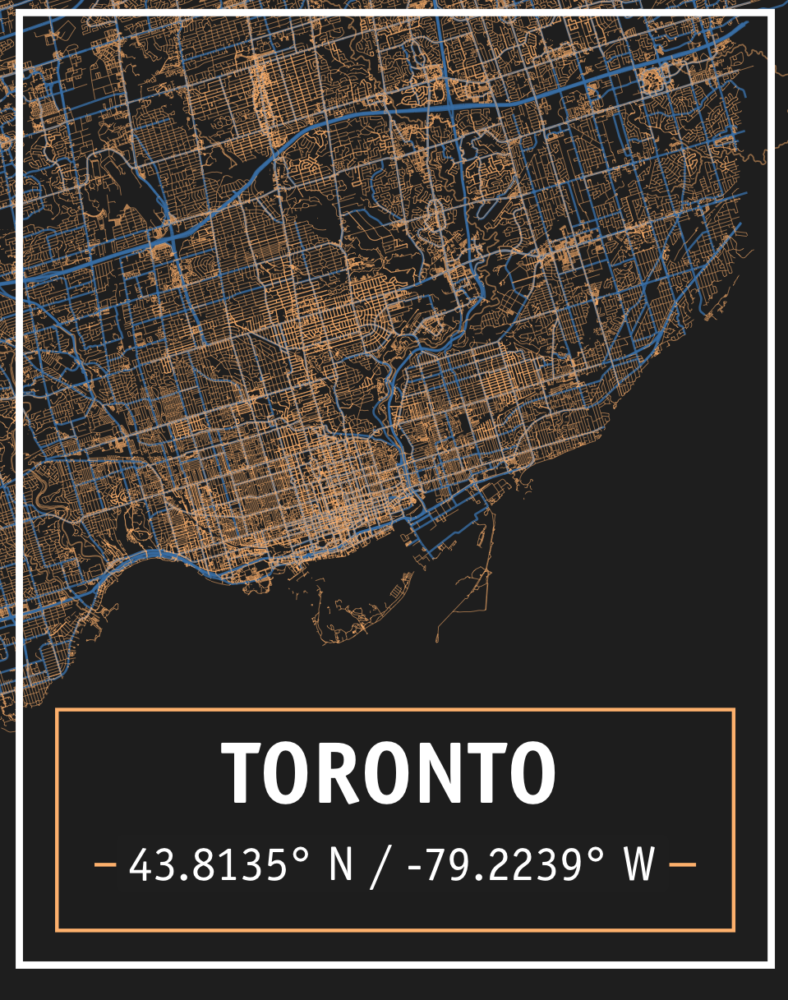

# FISHWONGY.github.io

Welcome to the repository for my personal website, where I share insights and articles about data engineering, data architecture, and data visualization. I am passionate about architecting data stacks and exploring the world of data.

## ✨ About the Website
This website is built using [blogdown](https://github.com/rstudio/blogdown) with the [Novela](https://github.com/forestryio/hugo-theme-novela) theme. 

## ✨ Example Blog Posts

1. **[AIOPS Webex BOT](https://fishwongy.github.io/post/20231228_aiwebexbot/) - Building an AI Webex BOT with Azure OpenAI API**

   

   
   

2. **[Exploring Orchestration Tool for Data Pipelines](https://fishwongy.github.io/post/20230625_orchestrationtool/) - Building a simple data pipeline with Dagster & Prefect**

   

  
   

3. **[Generative Art for Home Deco](https://fishwongy.github.io/post/20210305_generativeart/) - Creating Generative Art with R**

  

   
